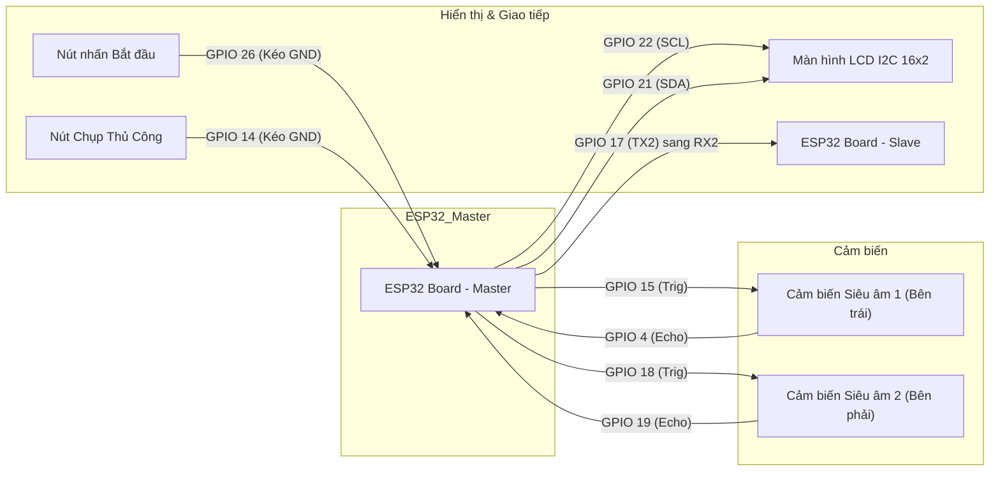
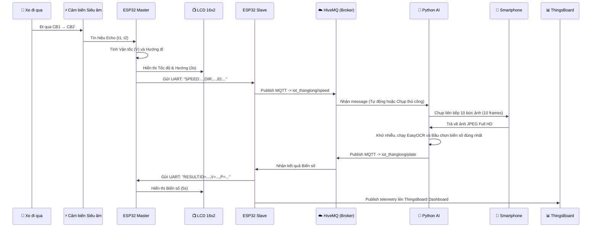

# Hệ Thống IoT Đo Tốc Độ và Nhận Diện Biển Số Xe Bằng AI

Hệ thống IoT thông minh giúp phát hiện xe, đo tốc độ di chuyển và tự động chụp ảnh nhận diện biển số (ALPR) bằng Điện thoại (Smartphone). Dữ liệu được thu thập và đồng bộ lên nền tảng ThingsBoard thông qua giao thức MQTT siêu tốc.

---

## 🏗️ Kiến Trúc Hệ Thống

Hệ thống sử dụng cảm biến siêu âm để đo tốc độ, truyền dữ liệu qua UART và MQTT. Hình ảnh được xử lý nét căng bằng Smartphone và gửi lên PC chạy AI.

1. **Master ESP32 (`IOT.ino`)**: 
   - Đo tốc độ từ 2 cảm biến siêu âm.
   - Gắn ID định danh cho mỗi lượt xe và gửi qua UART cho Slave.
   
2. **Slave ESP32 (`IOT_2.ino`)**: 
   - Đóng vai trò là "MQTT Router".
   - Nhận Tốc độ + ID từ UART và bắn ngay lập tức lên MQTT (HiveMQ).

3. **Smartphone Camera (IP Webcam / DroidCam)**:
   - Dùng làm Camera chụp ảnh sắc nét (Full HD) kết nối trực tiếp với Máy tính thông qua cáp USB (Tethering).

4. **Python Server (`alpr_server.py`)**:
   - Lắng nghe Tốc độ từ HiveMQ.
   - Nhận được tốc độ -> Kích hoạt Smartphone chụp ảnh -> Chạy AI (EasyOCR) nhận diện biển số.
   - Đẩy dữ liệu hoàn chỉnh lên ThingsBoard.

---

## 🔌 Sơ Đồ Đấu Nối Phần Cứng



### Bảng tóm tắt các chân GPIO

| Linh kiện | Chân trên Linh kiện | Chân trên ESP32 | Ghi chú |
| :--- | :--- | :--- | :--- |
| **Cảm biến 1** | TRIG | `GPIO 15` | Phát xung siêu âm |
| | ECHO | `GPIO 4` | Nhận tín hiệu phản hồi |
| **Cảm biến 2** | TRIG | `GPIO 18` | Phát xung siêu âm |
| | ECHO | `GPIO 19` | Nhận tín hiệu phản hồi |
| **LCD I2C 16x2**| SDA | `GPIO 21` | I2C Data mặc định của ESP32 Master |
| | SCL | `GPIO 22` | I2C Clock mặc định của ESP32 Master |
| **ESP32 Slave** | RX2 | `GPIO 16` | Nối vào chân TX2 (17) của Master để nhận tốc độ |
| **Nút nhấn 1** | Bắt đầu / Dừng đo | `GPIO 26` | Kéo GND khi nhấn (Sử dụng INPUT_PULLUP) |
| **Nút nhấn 2** | Chụp ảnh thủ công | `GPIO 14` | Kéo GND khi nhấn để gửi lệnh chụp ngay lập tức |

*Lưu ý: Bạn phải nối chung chân GND giữa mạch Master và mạch Slave.*

---

## 🔄 Luồng Hoạt Động (End-to-End Workflow)



---

## 🚀 Hướng Dẫn Chạy Hệ Thống

### Bước 1: Nạp Code cho 2 mạch ESP
- Mở Arduino IDE.
- Nạp `IOT.ino` cho mạch Master.
- Điền WiFi của bạn vào `IOT_2.ino` và nạp cho mạch Slave.

### Bước 2: Thiết Lập Camera Điện Thoại
- Dùng dây USB cắm điện thoại vào máy tính, bật "Chia sẻ mạng qua USB (Tethering)".
- Mở App **IP Webcam** trên điện thoại, ấn **Start Server**. Ghi nhớ đường link IP hiện ra (VD: `http://192.168.42.129:8080`).

### Bước 3: Cấu Hình Python Server
Mở file `alpr_server.py` trong thư mục `Python_ALPR`:
- Cập nhật dòng `IP_WEBCAM_URL = "http://192.168.42.129:8080/photo.jpg"` bằng link của bạn.
- Đảm bảo `TB_TOKEN` đã đúng.

Chạy lệnh để cài đặt thư viện:
```bash
pip install opencv-python numpy easyocr paho-mqtt requests flask
```

Khởi động Server:
```bash
python alpr_server.py
```

### Bước 4: Vận Hành & Căn Chỉnh Camera
1. **Căn chỉnh Camera:** Mở trình duyệt web truy cập vào `http://localhost:5000/`. Bạn sẽ thấy luồng video trực tiếp có hình chữ thập (Crosshair) màu đỏ ở giữa. Hãy điều chỉnh góc camera điện thoại sao cho chữ thập ngắm chuẩn vào làn đường đo tốc độ của cảm biến.
2. **Chụp thủ công (Manual Capture):** Nhấn nút vật lý nối vào `GPIO 14` trên mạch Master. ESP32 sẽ lập tức ra lệnh cho Python chụp 10 bức ảnh và nhận diện (Rất hữu ích để test góc nhìn).
3. **Đo tốc độ tự động:** Cho xe chạy qua 2 cảm biến siêu âm. Mạch Master sẽ tính tốc độ -> truyền cho Slave -> báo Python chụp 10 bức ảnh nét -> AI bầu chọn kết quả tốt nhất -> Lưu ảnh và gửi lên Node.js để phạt nguội!

---

## 📁 Cấu Trúc Thư Mục
- `/IOT_/` : Chứa code của Master ESP32.
- `/IOT_2/`: Chứa code của Slave ESP32 MQTT Router.
- `/Python_ALPR/`: Chứa file mã nguồn chạy AI (`alpr_server.py`).
- `/archive/`: Thư mục lưu trữ mớ hỗn độn ESP32-CAM cũ.
