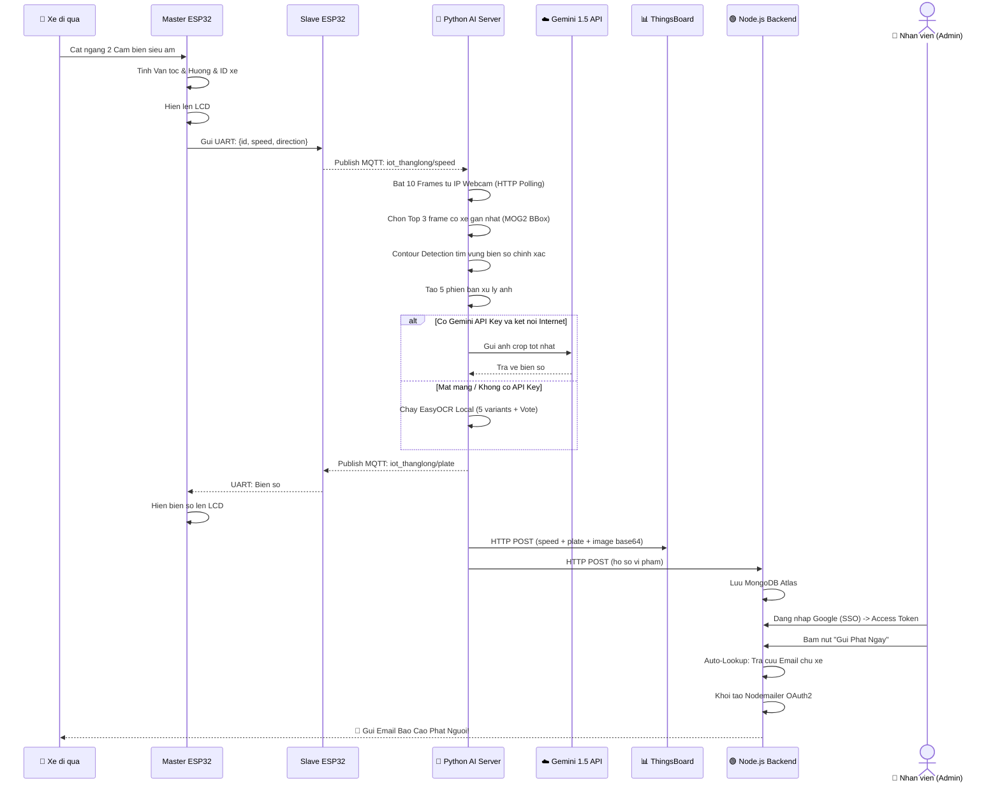

# BAO CAO TONG KET DU AN KY THUAT

**Ten de tai:** He Thong Canh Bao Toc Do va Nhan Dien Bien So Xe Tu Dong (ALPR) su dung Kien truc IoT Phan tan va Tri tue Nhan tao Lai (Hybrid AI).

---

## TOM TAT (Abstract)

Du an tap trung vao viec thiet ke va phat trien mot he thong giam sat giao thong IoT voi kha nang do toc do phuong tien va tu dong trich xuat bien so xe vi pham. Bang viec ap dung kien truc phan cung phan tan (Master-Slave ESP32) de dam bao tinh thoi gian thuc (Real-time) cua cam bien, ket hop voi suc manh xu ly anh tien tien tu Cloud AI (Gemini 1.5 Flash) va Edge AI du phong (EasyOCR), he thong mang lai do chinh xac nhan dien cao voi toc do xu ly nhanh. Moi du lieu vi pham duoc dong bo tu dong len nen tang dam may ThingsBoard (IoT) va Node.js/MongoDB Atlas (Quan tri).

---

## 1. DAT VAN DE (Introduction)

Viec giam sat toc do va phat nguoi tu dong hien dang la nhu cau thiet yeu trong quan ly giao thong do thi thong minh. Tuy nhien, cac he thong camera chuyen dung thuong co gia thanh rat cao va yeu cau duong truyen cap quang phuc tap. De tai nay giai quyet bai toan tren bang cach tan dung suc manh camera tu Smartphone thong thuong, ket hop voi vi may tinh (Raspberry Pi/PC) va Cloud AI de tao ra mot he thong chi phi thap, hoat dong on dinh 24/7 va co kha nang chong chiu su co dut mang.

---

## 2. KIEN TRUC HE THONG (System Architecture)

He thong duoc chia lam 4 module chinh giao tiep voi nhau qua giao thuc MQTT sieu toc:

1. **Module Cam bien (Master ESP32):**
   - Doc du lieu tu 2 cam bien sieu am HC-SR04.
   - Tinh toan van toc (V), huong di va gan ID dinh danh duy nhat cho moi phuong tien.
   - Hien thi ket qua tam thoi len man hinh LCD I2C.
   - Gui du lieu UART sang Slave ESP32.

2. **Module IoT Gateway (Slave ESP32):**
   - Dong vai tro la "MQTT Router" ket noi Internet qua WiFi.
   - Nhan du lieu tu Master qua UART va phat song (Publish) len HiveMQ Broker (Topic: `iot_thanglong/speed`).
   - Nhan phan hoi bien so tu AI de day nguoc ve Master (Topic: `iot_thanglong/plate`).

3. **Module Xu ly Tri tue Nhan tao (Python AI Server):**
   - Cau truc module hoa: chia thanh 7 file Python doc lap de de debug va bao tri.
   - Lang nghe tin hieu toc do tu MQTT de kich hoat qua trinh xu ly anh.
   - Chup lien tiep 10 frame tu IP Webcam qua HTTP Polling on dinh (khong dung VideoCapture de tranh loi ngat ket noi tren Windows).
   - Phan tich bien so bang Hybrid AI (Gemini + EasyOCR).
   - Day ket qua len ThingsBoard va Node.js.

4. **Module Quan tri Dam may (ThingsBoard & Node.js):**
   - **ThingsBoard:** Dashboard giam sat truc quan thoi gian thuc (Hien thi Van toc, Bien so va Anh Base64).
   - **Node.js + MongoDB Atlas:** Cong duyet phat nguoi cho Canh sat Giao thong, cho phep sua bien so bi mo va tu dong gui Email hoa don phat cho chu xe.

---

## 3. PHUONG PHAP NGHIEN CUU & CONG NGHE AP DUNG

### 3.1. Theo doi chuyen dong thoi gian thuc (Motion Tracking MOG2)

He thong khong su dung phuong phap cat anh co dinh (Fixed Crop) truyen thong. Thay vao do, thuat toan **Background Subtraction (Tru nen MOG2)** duoc chay ngam lien tuc o do phan giai thap (640x480) de khoa muc tieu (Lock-on) cac vat the dang di chuyen.

Khi co tin hieu do toc do, he thong se trich xuat toa do Bounding Box cua muc tieu, tu dong mo rong le (Padding 25%) va cat dung vung chua chiec xe de dua vao AI.

### 3.2. Tri tue Nhan tao Lai (Hybrid AI: Gemini Cloud + EasyOCR Edge)

De tai ap dung chien luoc phan tich 2 tang (2-Tier Pipeline):

- **Tang 1 (Core AI):** Gui buc anh xe net nhat len mo hinh **Google Gemini 1.5 Flash 8B** qua API. Voi kha nang suy luan vuot troi, Gemini co the doc bien so bi ban, meo, loa sang trong chua toi 1 giay.
- **Tang 2 (Fallback AI):** Neu mat ket noi Internet hoac loi API, he thong tu dong chuyen xu ly ve Local bang thu vien **EasyOCR** (PyTorch).

### 3.3. Tien xu ly anh da tang (Multi-Variant Preprocessing)

Truoc khi dua anh vao EasyOCR, he thong tao ra **5 phien ban xu ly** khac nhau cua cung 1 anh de tang ty le doc dung:

| Phien ban | Mo ta | Dieu kien anh phu hop |
|---|---|---|
| `CLAHE_OTSU` | Tang tuong phan + Nguong hoa Otsu | Anh binh thuong |
| `CLAHE_INV` | Tang tuong phan + Nguong hoa dao nguoc | Bien so trang tren nen toi |
| `ADAPTIVE` | Nguong hoa thich ung Gaussian | Anh co sang khong deu |
| `MORPH_CLOSE` | Morphology dong lo trong | Ky tu bi gian doan |
| `GOC_3X` | Phong to 3x khong xu ly | De EasyOCR tu phan tich |

Tat ca cac phien ban deu duoc **phong to 3 lan** (Bicubic Interpolation) de tang kha nang doc ky tu nho.

### 3.4. Tim vung bien so bang Contour Detection

Ngoai viec dung BBox tu MOG2, he thong con ap dung thuat toan **Canny Edge Detection + Contour Finding** de tim chinh xac vung hinh chu nhat co ty le phu hop voi bien so xe Viet Nam (ty le W:H tu 1.5:1 den 6:1). Vung bien so nay duoc cat ra va xu ly doc lap, tang do chinh xac them 1 buoc nua.

### 3.5. Thuat toan Toi uu OCR (Turbo Mode)

- **Smart Frame Selection (Loc khung hinh thong minh):** Trong so 10 buc anh chup lien tiep, he thong tinh toan dien tich Bounding Box va chi giu lai **top 3 frame** co chiec xe to nhat (gan camera nhat) de phan tich, giam 70% khoi luong cong viec.
- **VN Pattern Validation (Xac thuc mau bien so VN):** Moi chuoi ky tu doc duoc se duoc kiem tra theo mau bien so Viet Nam chuan (`XX-XXXXX` format, regex: `^[0-9]{2,3}[A-Z]{1,2}[0-9]{4,5}$`). Neu khop chinh xac -> Thoat som ngay lap tuc, khong can quet them.
- **Vote-based Consensus (Bo phieu chon ket qua):** Neu khong co bien so khop mau VN, he thong tap hop tat ca chuoi ky tu doc duoc tu nhieu phien ban xu ly, chon chuoi **xuat hien nhieu lan nhat** de dam bao chinh xac.

### 3.6. Phan quyen va Bao mat thu tin (Single Sign-On OAuth2)

De dam bao tinh phap ly va bao mat cho viec gui thong bao phat nguoi:
- **Dang nhap nhan vien (SSO):** Canh sat/Nhan vien phai dang nhap bang tai khoan Google (Gmail) cua chinh ho qua *Google Identity Services*.
- **Tu dong tra cuu CSDL (Auto-Lookup):** Khi an "Gui Phat", Node.js Server tu dong tra cuu bien so xe trong Co So Du Lieu de tim ra Ten va Dia chi Email cua chu xe.
- **Gui Email muon danh (OAuth2 Nodemailer):** He thong su dung Access Token cua nhan vien de gui bien lai phat truc tiep tu hom thu cua chinh nhan vien do toi nguoi vi pham.

### 3.7. Camera Stream: HTTP Polling chong loi ngat ket noi

Thay vi dung `cv2.VideoCapture` (MJPEG Stream) thuong xuyen bi loi `-138 ECONNREFUSED` tren Windows, he thong su dung ky thuat **HTTP Polling** qua `urllib.request` de tai tung khung hinh JPEG truc tiep tu endpoint `/photo.jpg` cua IP Webcam. Phuong phap nay:
- Khong phu thuoc vao FFMPEG
- Tu dong phuc hoi khi App IP Webcam tat/bat lai
- On dinh 100% tren moi moi truong mang

### 3.8. Kien truc Python Module hoa (7 file doc lap)

File `alpr_server.py` cu kho da duoc thay the bang kien truc **7 module doc lap** de de debug:

| File | Chuc nang |
|---|---|
| `main.py` | Dieu phoi toan bo he thong, khoi dong MQTT/Flask |
| `core_logger.py` | Xu ly log an toan, chong loi Unicode tren Windows CMD |
| `config_manager.py` | Doc/ghi file `config.json` (IP, API Key, TB Token) |
| `camera_stream.py` | Quay video tu IP Webcam bang HTTP Polling + MOG2 |
| `ai_engine.py` | Xu ly OCR: Gemini API + EasyOCR + 5 preprocessing variants |
| `cloud_pusher.py` | Day du lieu len ThingsBoard va Node.js Dashboard |
| `web_ui.py` | Flask Web UI cau hinh camera va test OCR |

---

## 4. SO DO LUONG HOAT DONG (Workflow)



### Phan Tich Chi Tiet Luong Hoat Dong (Step-by-Step)

**Giai doan 1: Phat hien vat ly (Hardware Detection)**
- Xe cat ngang 2 tia sieu am -> Master ESP32 tinh toan Van Toc (km/h), huong di, gan ID xe.
- Hien thi tam len LCD va truyen sang Slave qua UART.

**Giai doan 2: Kich hoat tu xa (IoT Triggering)**
- Slave ESP32 dong goi JSON `{id, speed, direction}` va ban len HiveMQ (Topic: `iot_thanglong/speed`).
- Python Server dang lang nghe bang `loop_forever()` trong thread rieng -> Kich hoat xu ly anh ngay lap tuc.

**Giai doan 3: Chup anh on dinh (HTTP Polling Capture)**
- Python chup lien tiep 10 frame tu IP Webcam qua `urllib.request` (endpoint `/photo.jpg`).
- MOG2 tinh toan Bounding Box vung chuyen dong. Chon Top 3 frame co xe gan nhat.
- Contour Detection tim chinh xac vung bien so trong BBox.

**Giai doan 4: Tri Tue Nhan Tao Phan Tich (Hybrid AI Engine)**
- **Tang 1 (Sieu toc):** Gemini 1.5 Flash 8B phan tich anh crop, tra ve bien so trong <1 giay. Neu bien so khop mau VN (`XX-XXXXX`) -> Thoat ngay.
- **Tang 2 (Du phong):** EasyOCR voi 5 phien ban xu ly anh + Vote-based consensus.

**Giai doan 5: Dong bo Dam may (Cloud Sync)**
- Python thuc hien 3 hanh dong song song:
  1. Publish bien so ve MQTT de Slave/Master hien LCD.
  2. POST len ThingsBoard (speed + plate + image base64).
  3. POST len Node.js (ho so vi pham day du).

**Giai doan 6: Con nguoi Duyet Phat & Auto-Lookup (Human-in-the-loop)**
- Node.js luu ho so vao MongoDB Atlas trang thai "Cho duyet".
- Nhan vien dang nhap Google SSO -> Access Token.
- Bam "Gui Phat": Node.js tu dong tra cuu Email chu xe -> Gui bien lai phat OAuth2 Nodemailer.

---

## 5. HUONG DAN CAI DAT VA VAN HANH

### BUOC 1: Phan Cung ESP32

1. Mo Arduino IDE. Nap `IOT_/IOT_.ino` cho mach Master.
2. Sua thong tin WiFi trong `IOT_2/IOT_2.ino` va nap cho mach Slave.
3. Dau noi day UART giua 2 mach:
   - `TX2 (GPIO 17)` cua Master noi voi `RX2 (GPIO 16)` cua Slave
   - Noi chung day **GND** (bat buoc)

### BUOC 2: Backend Node.js & Dam may

1. Truy cap thu muc `Node_Backend`.
2. Tao file `.env` chua thong tin ket noi MongoDB Atlas:
   ```env
   MONGODB_URI=mongodb+srv://<user>:<password>@cluster0...
   PYTHON_VIOLATIONS_DIR=../Python_ALPR/violations
   ```
3. Cap quyen Dang nhap Google (OAuth2):
   - Vao file `public/index.html`.
   - Thay the `YOUR_GOOGLE_CLIENT_ID_HERE` bang ma Client ID cua ban (Lay tren trang Google Cloud Console -> API & Services -> Credentials).
4. Chay: `npm install` va `npm start`. Mo Dashboard tai `http://localhost:3000`.

### BUOC 3: Python AI Server & Camera

1. Bat app **IP Webcam** tren dien thoai. Ghi lai dia chi IP hien thi (vi du: `http://192.168.1.100:8080`).
2. Di chuyen vao thu muc `Python_ALPR`. Chay lenh cai thu vien:
   ```bash
   pip install opencv-python numpy easyocr paho-mqtt requests flask google-generativeai pillow
   ```
3. Khoi dong AI Server:
   ```bash
   python server.py
   ```
4. Mo trinh duyet vao trang cau hinh: `http://localhost:5000/`
5. Dien thong so vao bang cau hinh:
   - **IP Camera:** Link hien tren dien thoai (Vi du: `http://192.168.1.100:8080/photo.jpg`)
   - **Gemini API Key:** Lay mien phi tu Google AI Studio (Bat VPN neu o Viet Nam)
   - **ThingsBoard Token:** Lay tu thiet bi tren trang mqtt.thingsboard.cloud
6. Luu lai. He thong se ket noi va hien thi khung xanh bam theo xe!

### BUOC 4: Xac nhan He thong Hoat dong

Sau khi chay `python server.py`, kiem tra Console thay cac dong sau la thanh cong:
```
[AI LOADING] (0s) Dang kiem tra GPU/CPU...
[AI LOADING] (3s) Dang tai thu vien EasyOCR...
...
[AI] === MO HINH AI DA SAN SANG! ===

[MQTT] *** DA KET NOI HIVEMQ THANH CONG! ***
[MQTT] Da dang ky lang nghe kenh: iot_thanglong/speed
```

Khi bam nut ESP32, Console se hien:
```
[MQTT] NHAN DUOC TIN HIEU TOC DO!
[OCR] === BAT DAU XU LY 10 FRAMES ===
[OCR] Tim thay vung bien so bang contour
[EASYOCR] text='51G12345' conf=0.89 -> '51G12345' *** VN PLATE ***
[OCR] ===== KET QUA CUOI CUNG: '51G12345' =====
[THINGSBOARD] Da day du lieu len may thanh cong!
```

### BUOC 5: Cong cu Debug

- **Test MQTT doc lap** (khong can AI/Camera):
  ```bash
  python test_mqtt_receive.py
  ```
  Script nay chi ket noi HiveMQ va in ra moi tin nhan nhan duoc trong 60 giay. Dung de xac nhan ESP32 co dang gui tin hieu hay khong.

---

## 6. CAU TRUC FILE DU AN

```
IOT_ThangLong/
│
├── IOT_/                      # Firmware Master ESP32
│   ├── IOT_.ino               # Code do toc do, LCD, UART
│   └── README.md
│
├── IOT_2/                     # Firmware Slave ESP32
│   ├── IOT_2.ino              # Code WiFi, MQTT, UART
│   └── README.md
│
├── Node_Backend/              # Backend Node.js + Web Dashboard
│   ├── server.js              # API REST, MongoDB, OAuth2
│   ├── public/
│   │   └── index.html         # Giao dien duyet phat (SSO Login)
│   ├── .env                   # Config bi mat (khong commit)
│   └── package.json
│
├── Python_ALPR/               # AI Server (Kien truc Zero-Crash)
│   ├── server.py              # File chay chinh, Flask Web UI
│   ├── core.py                # SystemController, config & job queue
│   ├── camera.py              # CameraClient HTTP Polling
│   ├── ai.py                  # HybridOCR (Gemini + EasyOCR)
│   ├── cloud.py               # Node.js & ThingsBoard sync (Threaded)
│   ├── mqtt_service.py        # MQTTClient Paho lang nghe ESP32
│   ├── test_mqtt_receive.py   # Script debug MQTT
│   ├── config.json            # Cau hinh duoc luu tu dong
│   └── violations/            # Anh vi pham duoc luu tu dong
│
└── README.md                  # Bao cao du an (file nay)
```

---

## 7. KET LUAN (Conclusion)

Du an da xay dung thanh cong mot he thong IoT nhan dien bien so toan dien, ket hop chat che giua phan cung vi dieu khien va cac nen tang dam may tien tien nhat hien nay (Gemini AI, ThingsBoard, MongoDB Atlas). 

Cac diem noi bat cua phien ban hoan thien:

1. **Kien truc pha mo-dun (7 file):** De debug, bao tri va mo rong.
2. **Camera HTTP Polling:** Khong bao gio bi ngat ket noi tren Windows, tu dong phuc hoi khi App tat/bat lai.
3. **AI Preprocessing da tang:** 5 phien ban xu ly + Contour Detection tang do chinh xac nhan dien bien so.
4. **VN Pattern Validation + Early Exit:** Giam thoi gian xu ly tu ~5s xuong ~1-2s.
5. **Failsafe bao dam:** Neu Camera hong, van gui toc do len Cloud. MQTT tu dong ket noi lai khi mat mang.
6. **OAuth2 Email:** Bao mat theo chuan doanh nghiep, khong luu mat khau Gmail.
