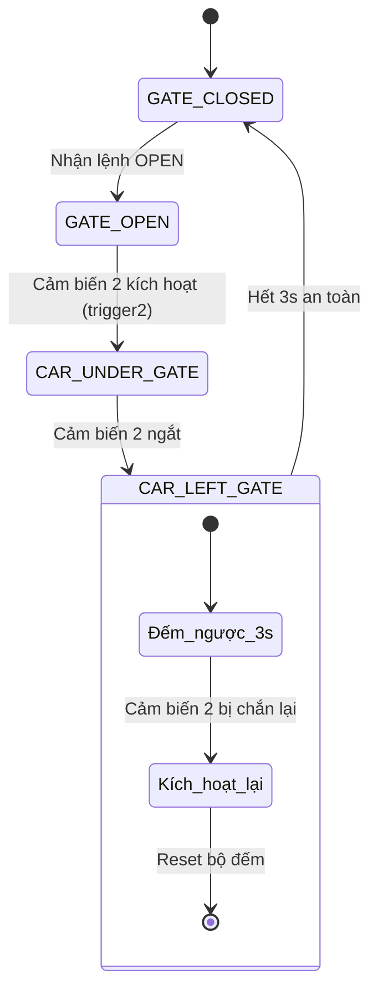

# BÁO CÁO KHOA HỌC: HỆ THỐNG NHẬN DIỆN BIỂN SỐ TỰ ĐỘNG (ALPR) TÍCH HỢP IOT CHO TRẠM THU PHÍ

> **Tóm tắt (Abstract):** 
> Dự án này đề xuất và triển khai một giải pháp Trạm Thu Phí Thông minh ứng dụng Internet of Things (IoT) và Trí tuệ Nhân tạo (AI). Hệ thống sử dụng kiến trúc phân tán với 2 vi điều khiển ESP32 đảm nhiệm logic vật lý (Zero-Crash) và giao tiếp mạng cục bộ (LAN HTTP). Mô hình AI Lai (Hybrid AI) kết hợp giữa API Gemini-3.5-Flash (Cloud) và EasyOCR (Edge) đảm bảo khả năng đọc biển số tốc độ cao và tự động dự phòng khi mất mạng. Cơ sở dữ liệu và cảnh báo được đồng bộ hóa toàn diện qua MongoDB, Firebase Realtime Database và Telegram Bot.

---

## 1. ĐẶT VẤN ĐỀ VÀ MỤC TIÊU (INTRODUCTION & OBJECTIVES)

### 1.1. Đặt vấn đề
Các hệ thống trạm thu phí truyền thống hoặc các bãi giữ xe bán tự động thường gặp phải các hạn chế:
- **Lỗi cảm biến vật lý:** Barie hạ xuống khi xe chưa đi qua hết gây va chạm (Crash).
- **Độ trễ mạng IoT:** Sự phụ thuộc vào các giao thức trung gian như MQTT/ThingsBoard gây ra độ trễ lớn trong thao tác đóng mở cổng.
- **Tính liền mạch dữ liệu:** Không có cơ chế lưu trữ đệm khi hệ thống mất kết nối mạng Internet.

### 1.2. Mục tiêu giải quyết
- 🛡️ **Kiến trúc Zero-Crash:** Áp dụng thuật toán bảo vệ kép (Double Check) qua cảm biến siêu âm, ngăn chặn tuyệt đối việc barie hạ sớm.
- ⚡ **Giao tiếp LAN HTTP (Micro-latency):** Các vi điều khiển giao tiếp trực tiếp với Server thông qua HTTP RESTful API, giảm độ trễ xuống dưới 50ms.
- 🧠 **Hybrid AI & Offline Queue:** Chạy song song Cloud AI (độ chính xác cao) và Edge AI (dự phòng). Đồng thời tích hợp cơ chế `SyncManager` để lưu file đệm CSV (Offline Queue) tự động đồng bộ khi có mạng.

---

## 2. KIẾN TRÚC HỆ THỐNG (SYSTEM ARCHITECTURE)

Hệ thống được chia làm 3 phân hệ chính:

### Phân hệ 1: Edge Devices (Thiết bị đầu cuối)
1. **Mạch 1 (ESP32 Master - `IOT.ino`):** Quản lý cảm biến, thuật toán đo nền (Calibration), điều khiển Động cơ Servo và nút bấm thủ công. Giao tiếp UART với Mạch 2.
2. **Mạch 2 (ESP32 Slave - `IOT_2.ino`):** Hoạt động như một Gateway. Giao tiếp WiFi cục bộ, quản lý màn hình LCD I2C, nhận lệnh và kích hoạt tiến trình chụp ảnh trên Server.
3. **Camera (Smartphone IP Webcam):** Đóng vai trò thu nhận luồng Video trực tiếp (MJPEG Stream) qua mạng LAN.

### Phân hệ 2: Processing Core (Lõi xử lý Python)
- **`server.py`:** Flask Web Server điều phối luồng logic, cung cấp giao diện quản trị Web UI và nhận HTTP Trigger từ ESP32.
- **`ai.py` (HybridOCR):** Chụp khung hình từ luồng Camera, nén ảnh, làm nét và gửi lên Gemini/EasyOCR để trích xuất biển số thông qua Regex.
- **`sync_manager.py`:** Luồng chạy nền (Background Thread) đồng bộ dữ liệu đa kênh.

### Phân hệ 3: Cloud Services (Dịch vụ Đám mây)
- **MongoDB Atlas:** Cơ sở dữ liệu chính, tra cứu ID khách hàng (Telegram ID) dựa trên biển số.
- **Firebase RTDB:** Lưu trữ lịch sử ra vào theo thời gian thực (Realtime Logging).
- **Telegram Bot:** Gửi ảnh và thông báo trực tiếp tới thiết bị di động của chủ phương tiện.

```mermaid
graph TD
    subgraph Edge Devices
        S1[Cảm biến 1 & 2] -->|Xung| ESP1[Mạch 1: ESP32 Master]
        ESP1 -->|UART| ESP2[Mạch 2: ESP32 Gateway]
        ESP2 -->|LCD I2C| L[Hiển thị LCD]
        CAM[Smartphone IP Webcam]
    end

    subgraph Processing Core
        ESP2 -- HTTP GET --> API[/trigger_capture]
        API --> PY[Python Server]
        CAM -- MJPEG Stream --> PY
        PY -- HTTP GET --> ESP2_API[/open_gate]
    end

    subgraph Cloud & Sync
        PY --> SYNC[Sync Manager Queue]
        SYNC -.->|Truy vấn| MONGO[(MongoDB)]
        SYNC -.->|Đồng bộ| FB[(Firebase)]
        SYNC -.->|Cảnh báo| TELE[Telegram Bot]
    end
```

### 2.1 Cấu trúc Thư mục Dự án
```text
IOT_ThangLong/
├── IOT_                 # Code Arduino Mạch 1 (ESP32 Master: Vật lý)
│   └── IOT.ino          # Firmware điều khiển Servo, Còi, Cảm biến
├── IOT_2                # Code Arduino Mạch 2 (ESP32 Gateway: LAN)
│   └── IOT_2.ino        # Firmware Web Server cục bộ & LCD I2C
├── Python_ALPR          # Lõi xử lý Máy chủ
│   ├── server.py        # Flask Web Server & API (/trigger_capture)
│   ├── ai.py            # AI Engine (Xử lý Gemini & EasyOCR)
│   ├── camera.py        # Bắt luồng ảnh MJPEG từ IP Webcam
│   ├── sync_manager.py  # Background Thread đồng bộ dữ liệu mây
│   ├── web_html.py      # Giao diện Bảng điều khiển (Web UI)
│   ├── core.py          # Lưu trạng thái (Controller) và cấu hình
│   ├── config.json      # Nơi lưu API Key và tùy chọn của người dùng
│   └── pending_sync.csv # File hàng đợi tạm thời khi mất kết nối mạng
└── README.md            # Tài liệu Báo cáo hệ thống
```

---

## 3. LƯU ĐỒ THUẬT TOÁN (WORKFLOW & FLOWCHART)

### 3.1. Luồng vận hành chính (Xe đi vào)
1. **Phát hiện:** Cảm biến 1 (Lối vào) phát hiện khoảng cách sụt giảm so với mẫu nền.
2. **Kích hoạt:** Mạch 1 truyền tín hiệu `CAR_IN` qua UART sang Mạch 2.
3. **Giao tiếp:** Mạch 2 gọi HTTP GET `/trigger_capture` tới máy tính (Server).
4. **Xử lý AI (Auto-Retry):** Server chụp ảnh. Nếu thất bại hoặc ảnh mờ, Server tự động chờ 1s và chụp bù lần 2. Biển số được trích xuất.
5. **Đồng bộ:** Biển số được đưa vào Queue. Background Thread tra cứu Mongo lấy `chat_id`, sau đó bắn ảnh qua Telegram và lưu log lên Firebase.
6. **Mở cổng:** Server phản hồi kết quả JSON. Mạch 2 đọc JSON, hiển thị LCD và phát lệnh `OPEN` cho Mạch 1 mở Servo.
7. **Đóng cổng an toàn:** Khi xe vượt qua Cảm biến 2, mạch 1 chờ 3 giây và đóng cổng.

### 3.2. Lưu đồ xử lý Zero-Crash


---

## 4. SƠ ĐỒ ĐẤU NỐI PHẦN CỨNG (WIRING DIAGRAM)

Yêu cầu cấp nguồn 5V ổn định cho cả hai mạch. Khuyến nghị nối chung Ground (GND) giữa Mạch 1 và Mạch 2 để giao tiếp UART ổn định.

### 4.1. Mạch 1 (ESP32 Master - Vật lý)
| Linh kiện | Chân trên Linh kiện | Chân trên ESP32 |
| :--- | :--- | :--- |
| **Cảm biến 1 (Lối vào)** | TRIG | `GPIO 13` |
| | ECHO | `GPIO 12` |
| **Cảm biến 2 (Lối ra)** | TRIG | `GPIO 5` |
| | ECHO | `GPIO 18` |
| **Servo (Cổng Barie)** | PWM (Tín hiệu) | `GPIO 4` |
| **Buzzer (Còi)** | Tín hiệu | `GPIO 14` |
| **Nút bấm thủ công** | Một đầu | `GPIO 26` |
| | Đầu kia | `GND` |
| **Giao tiếp Mạch 2** | TX (Gửi) | `GPIO 17` |
| | RX (Nhận) | `GPIO 16` |

### 4.2. Mạch 2 (ESP32 Slave - Mạng & Hiển thị)
| Linh kiện | Chân trên Linh kiện | Chân trên ESP32 |
| :--- | :--- | :--- |
| **Giao tiếp Mạch 1** | TX (Gửi) | `GPIO 17` (Nối RX Mạch 1)|
| | RX (Nhận) | `GPIO 16` (Nối TX Mạch 1)|
| **Màn hình LCD I2C** | SDA | `GPIO 21` |
| | SCL | `GPIO 22` |
| | VCC | `5V` (Hoặc 3V3 tùy module) |

---

## 5. CÀI ĐẶT VÀ TRIỂN KHAI (INSTALLATION)

### Bước 1: Mạng và Phần cứng
1. Phát WiFi từ Router hoặc Laptop với cấu hình bắt buộc:
   - Tên WiFi (SSID): `NONNET`
   - Mật khẩu: `abcd1234`
2. Cài đặt IP Tĩnh cho Laptop (Máy chủ) là: `192.168.137.1`.
3. Bật ứng dụng **IP Webcam** trên điện thoại Android, nhấn "Start server". (Ví dụ IP thu được là `http://192.168.137.233:8080`).

### Bước 2: Nạp Code ESP32
1. Mở Arduino IDE.
2. Cài đặt các thư viện cần thiết: `LiquidCrystal_I2C`, `ESP32Servo`.
3. Mở thư mục `IOT_`, nạp file `IOT.ino` vào Mạch 1.
4. Mở thư mục `IOT_2`, nạp file `IOT_2.ino` vào Mạch 2.

### Bước 3: Cài đặt Python Server
Yêu cầu: Môi trường Python 3.9+
```bash
# Di chuyển vào thư mục Server
cd Python_ALPR

# Tạo môi trường ảo (Khuyến nghị)
python -m venv venv
venv\Scripts\activate

# Cài đặt thư viện
pip install flask opencv-python easyocr google-generativeai requests pymongo
```

### Bước 4: Khởi động hệ thống
```bash
# Khởi chạy lõi xử lý
python server.py
```
- Truy cập vào **Bảng điều khiển Web (Dashboard)** tại địa chỉ: `http://localhost:5000` (hoặc `http://192.168.137.1:5000`).

---

## 6. HƯỚNG DẪN SỬ DỤNG (USAGE GUIDE)

### Cấu hình Hệ thống trên Web
Giao diện điều khiển cung cấp một bảng cấu hình toàn diện. Lần đầu sử dụng, bạn cần nhập:
1. **URL Camera:** Link IP Webcam từ điện thoại (vd: `http://192.168.137.233:8080/video`).
2. **Mô hình AI:** Chọn `Hybrid (Gemini + EasyOCR)` (Yêu cầu điền Gemini API Key) hoặc `Offline (EasyOCR)`.
3. **Dịch vụ Đám mây:** 
   - Điền Telegram Bot Token.
   - Điền Chuỗi kết nối MongoDB (URI).
   - Điền Firebase URL (Dạng `https://xyz.firebaseio.com/`).
   *(Hệ thống hỗ trợ gạt Tắt/Bật từng dịch vụ độc lập).*

### Vận hành
- **Tự động:** Đưa phương tiện đi ngang qua cảm biến 1. Hệ thống sẽ tự động chụp ảnh, phân tích, đẩy dữ liệu lên đám mây, mở cổng và tự đóng cổng.
- **Thủ công:** Trên giao diện Web có nút **"Chụp & Nhận Diện"** để test riêng hệ thống AI, hoặc các nút **"Mở Cổng" / "Đóng Cổng"** để can thiệp vật lý trực tiếp xuống ESP32.

> **Lưu ý Căn chỉnh:** Lần đầu cắm điện, mạch Master sẽ nháy đèn và chạy "Calibration" mất khoảng 2 giây để đo đạc không gian xung quanh làm mẫu nền. Không được đứng che cảm biến trong lúc này. Màn hình LCD sẽ báo `He thong SS` khi quá trình hoàn tất.
