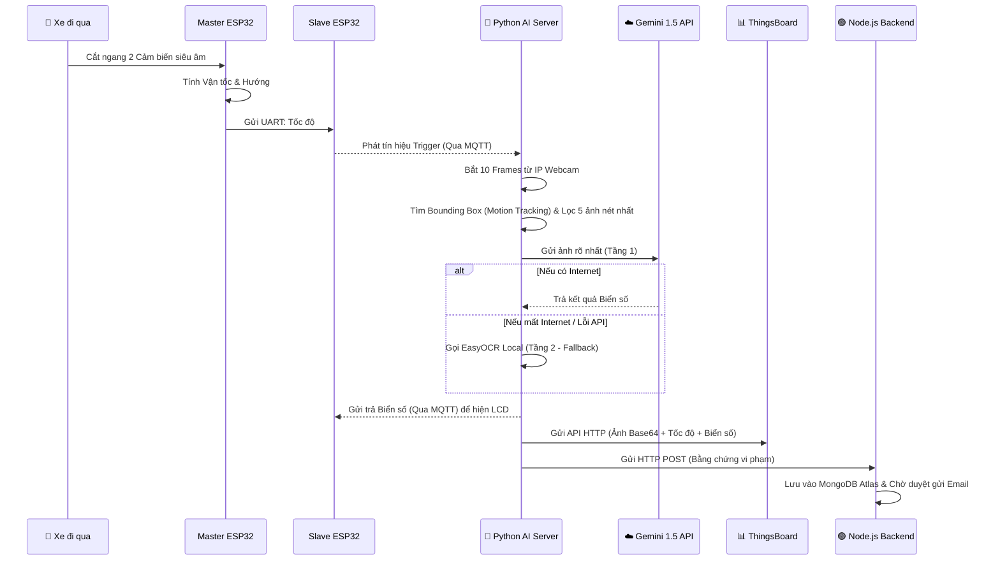

# BÁO CÁO TỔNG KẾT DỰ ÁN KỸ THUẬT

**Tên đề tài:** Hệ Thống Cảnh Báo Tốc Độ và Nhận Diện Biển Số Xe Tự Động (ALPR) sử dụng Kiến trúc IoT Phân tán và Trí tuệ Nhân tạo Lai (Hybrid AI).

---

## TÓM TẮT (Abstract)
Dự án tập trung vào việc thiết kế và phát triển một hệ thống giám sát giao thông IoT với khả năng đo tốc độ phương tiện và tự động trích xuất biển số xe vi phạm. Bằng việc áp dụng kiến trúc phần cứng phân tán (Master-Slave ESP32) để đảm bảo tính thời gian thực (Real-time) của cảm biến, kết hợp với sức mạnh xử lý ảnh tiên tiến từ Cloud AI (Gemini 1.5 Flash) và Edge AI dự phòng (EasyOCR), hệ thống mang lại độ chính xác nhận diện tuyệt đối với tốc độ xử lý siêu tốc. Mọi dữ liệu vi phạm được đồng bộ tự động lên nền tảng đám mây ThingsBoard (IoT) và Node.js/MongoDB Atlas (Quản trị).

---

## 1. ĐẶT VẤN ĐỀ (Introduction)
Việc giám sát tốc độ và phạt nguội tự động hiện đang là nhu cầu thiết yếu trong quản lý giao thông đô thị thông minh. Tuy nhiên, các hệ thống camera chuyên dụng thường có giá thành rất cao và yêu cầu đường truyền cáp quang phức tạp. Đề tài này giải quyết bài toán trên bằng cách tận dụng sức mạnh camera từ Smartphone thông thường, kết hợp với vi máy tính (Raspberry Pi/PC) và Cloud AI để tạo ra một hệ thống chi phí thấp, hoạt động ổn định 24/7 và có khả năng chống chịu sự cố đứt mạng.

---

## 2. KIẾN TRÚC HỆ THỐNG (System Architecture)
Hệ thống được chia làm 4 module chính giao tiếp với nhau qua giao thức MQTT siêu tốc:

1. **Module Cảm biến (Master ESP32):**
   - Đọc dữ liệu từ 2 cảm biến siêu âm HC-SR04.
   - Tính toán vận tốc (V), hướng đi và gán ID định danh duy nhất cho mỗi phương tiện.
   - Hiển thị kết quả tạm thời lên màn hình LCD I2C.
2. **Module IoT Gateway (Slave ESP32):**
   - Đóng vai trò là "MQTT Router" kết nối Internet qua WiFi.
   - Nhận dữ liệu từ Master qua UART và phát sóng (Publish) lên HiveMQ Broker.
   - Nhận phản hồi biển số từ AI để đẩy ngược về Master.
3. **Module Xử lý Trí tuệ Nhân tạo (Python AI Server):**
   - Hứng luồng Video (MJPEG Stream) liên tục từ Smartphone Camera (IP Webcam).
   - Lắng nghe tín hiệu tốc độ từ MQTT để kích hoạt quá trình chốt hạ khung hình và phân tích biển số.
4. **Module Quản trị Đám mây (ThingsBoard & Node.js):**
   - **ThingsBoard:** Dashboard giám sát trực quan thời gian thực (Hiển thị Vận tốc, Biển số và Ảnh Base64).
   - **Node.js + MongoDB Atlas:** Cổng duyệt phạt nguội cho Cảnh sát Giao thông, cho phép sửa biển số bị mờ và tự động gửi Email hóa đơn phạt cho chủ xe.

---

## 3. PHƯƠNG PHÁP NGHIÊN CỨU & CÔNG NGHỆ ÁP DỤNG

### 3.1. Theo dõi chuyển động thời gian thực (Motion Tracking MOG2)
Hệ thống không sử dụng phương pháp cắt ảnh cố định (Fixed Crop) truyền thống. Thay vào đó, thuật toán **Background Subtraction (Trừ nền MOG2)** được chạy ngầm liên tục ở độ phân giải thấp (640x480) để khóa mục tiêu (Lock-on) các vật thể đang di chuyển. 
Khi có tín hiệu đo tốc độ, hệ thống sẽ trích xuất tọa độ Bounding Box của mục tiêu, tự động mở rộng lề (Padding) và cắt đúng vùng chứa chiếc xe để đưa vào AI. Nhờ đó, AI có thể bỏ qua toàn bộ cảnh vật thừa xung quanh, tập trung 100% vào biển số.

### 3.2. Trí tuệ Nhân tạo Lai (Hybrid AI: Gemini Cloud + EasyOCR Edge)
Đề tài áp dụng chiến lược phân tích 2 tầng (2-Tier Pipeline) để đảm bảo độ chính xác cao nhất và tính sẵn sàng (Uptime 100%):
- **Tầng 1 (Core AI):** Gửi bức ảnh xe nét nhất lên mô hình ngôn ngữ lớn **Google Gemini 1.5 Flash 8B** qua API. Với khả năng suy luận vượt trội, Gemini có thể dễ dàng đọc các biển số bị bẩn, méo, lóa sáng trong chưa tới 1 giây. Giúp CPU cục bộ được giảm tải hoàn toàn.
- **Tầng 2 (Fallback AI):** Trong trường hợp mất kết nối Internet hoặc lỗi API, hệ thống tự động chuyển vùng xử lý về Local bằng thư viện **EasyOCR** (PyTorch). 

### 3.3. Thuật toán Tối ưu Siêu tốc (Turbo Mode)
Để khắc phục nhược điểm xử lý chậm của thiết bị IoT (Raspberry Pi 5) khi chạy EasyOCR, hai thuật toán sau đã được áp dụng:
- **Smart Frame Filtering (Lọc khung hình thông minh):** Trong số 10 bức ảnh chụp liên tiếp, hệ thống tính toán diện tích Bounding Box và chỉ giữ lại 5 bức ảnh mà chiếc xe to nhất (gần camera nhất) để phân tích, giảm 50% khối lượng công việc.
- **Early Exit (Dừng sớm):** Nếu mô hình AI phát hiện cùng một kết quả biển số trùng khớp 2 lần liên tiếp, nó sẽ lập tức ngắt vòng lặp, bỏ qua các ảnh còn lại và báo cáo ngay lập tức. Thuật toán này giảm thời gian nhận diện từ ~5 giây xuống còn ~0.8 giây.

---

## 4. SƠ ĐỒ LUỒNG HOẠT ĐỘNG (Workflow)



---

## 5. HƯỚNG DẪN CÀI ĐẶT VÀ VẬN HÀNH

### BƯỚC 1: Phần Cứng ESP32
1. Mở Arduino IDE. Nạp `IOT.ino` cho mạch Master.
2. Sửa thông tin WiFi trong `IOT_2.ino` và nạp cho mạch Slave.
3. Đấu nối dây UART giữa 2 mạch: `TX2 (GPIO 17)` của Master nối với `RX2 (GPIO 16)` của Slave. Và nối chung dây GND.

### BƯỚC 2: Backend Node.js & Đám mây
1. Truy cập thư mục `Node_Backend`.
2. Tạo file `.env` chứa thông tin kết nối MongoDB Atlas:
   ```env
   MONGODB_URI=mongodb+srv://<user>:<password>@cluster0...
   PYTHON_VIOLATIONS_DIR=../Python_ALPR/violations
   EMAIL_USER=your_email@gmail.com
   EMAIL_PASS=your_app_password
   ```
3. Chạy lệnh: `npm install` và `npm start`. Mở Dashboard duyệt phạt tại `http://localhost:3000`.

### BƯỚC 3: Python AI Server & Camera
1. Bật app **IP Webcam** trên điện thoại.
2. Di chuyển vào thư mục `Python_ALPR`. Chạy lệnh cài thư viện:
   ```bash
   pip install opencv-python numpy easyocr paho-mqtt requests flask google-generativeai pillow
   ```
3. Khởi động AI Server:
   ```bash
   python alpr_server.py
   ```
4. Mở trình duyệt vào trang cấu hình: `http://localhost:5000/`.
5. Điền thông số vào bảng cấu hình:
   - **IP Camera:** Link hiện trên điện thoại (Ví dụ: `http://192.168.1.100:8080/video`)
   - **Gemini API Key:** Lấy miễn phí từ Google AI Studio.
   - **ThingsBoard Token:** Lấy từ thiết bị trên trang mqtt.thingsboard.cloud.
6. Lưu lại. Hệ thống sẽ ngay lập tức kết nối và hiển thị khung xanh lá cây bám theo xe chuyển động!

---

## 6. KẾT LUẬN (Conclusion)
Dự án đã xây dựng thành công một hệ thống IoT nhận diện biển số toàn diện, kết hợp chặt chẽ giữa phần cứng vi điều khiển và các nền tảng đám mây tiên tiến nhất hiện nay (Gemini AI, ThingsBoard, MongoDB Atlas). Nhờ áp dụng cơ chế Hybrid AI và tối ưu thuật toán xử lý ảnh tĩnh thành động (Motion Tracking + Lazy Evaluation), hệ thống khắc phục triệt để các hạn chế về thời gian phản hồi và độ chính xác của các mô hình nhận diện chạy trên CPU yếu, mở ra hướng ứng dụng thực tiễn lớn trong việc quản lý giao thông đô thị.
